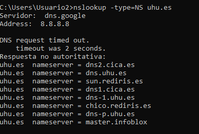
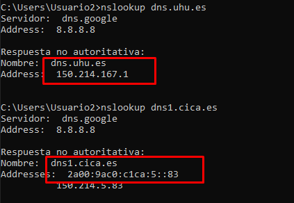
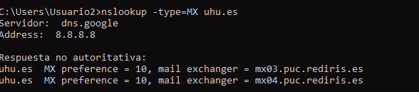
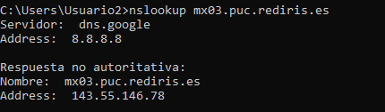
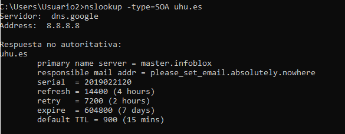
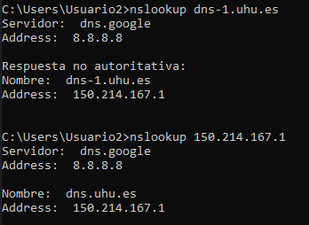
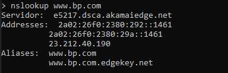
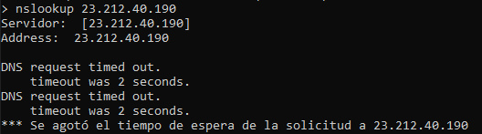
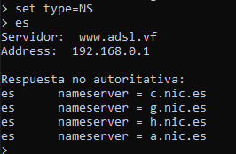

#NSLOOKUP

## 1.	La UHU (Universidad de Huelva) tiene varios servidores DNS. Consulta a tu servidor DNS por defecto sus direcciones IP al menos 2 de ellos.

## 2.	¿Son las respuestas anteriores autoritativas? 
No ya que solo los propietarios del servidor o gestor del mismo pueden obtenerla

## 3.	Consulta la dirección IP de un servidor de correo de uhu.es.

## 4.	¿Son las respuestas anteriores autoritativas? 
Sí, ya que la respuesta es del servidor autoritativo del dominio. Además se comprueba que puede existir más de un servidor autoritativo para el mismo dominio.

## 5.	Si hay más de un servidor autoritativo para el dominio uhu.es, ¿cómo sabemos cuál es el primario?¿en qué fecha se actualizó por última vez?¿cúal es la dirección e-mail del administrador?

## 6.	Comprueba que el DNS inverso está bien configurado para dns-1.uhu.es.

## 7.	Comprueba que el DNS inverso está bien configurado para www.bp.com.

## 8.	Por defecto, el comando NSLOOKUP devuelve los registros de tipo A. ¿Qué se obtiene al consultar los registros NS?
Cuando utilizas el comando nslookup para consultar los registros de tipo NS (Name Server), obtienes una lista de los servidores DNS autoritativos para el dominio consultado. Estos registros indican los servidores responsables de gestionar la zona DNS del dominio.

## 9.	Consulta el TLD de las páginas de España: “es”.

## 10.	¿Se obtiene alguna respuesta?
No, porque por defecto se buscan registros de tipo A y tipo AAAA. Como “es” no es un FQDN, lo lógico es buscar registros NS para saber qué servidores lo resuelven.

## 11.	Consulta las direcciones IP de www.google.com.

## 12.	¿Puede un mismo nombre de dominio traducirse en varias direcciones IP distintas? 

Sí, un mismo nombre de dominio puede traducirse en varias direcciones IP distintas. Si un servidor falla, el sistema puede redirigir automáticamente las solicitudes a otra dirección IP, asegurando que el servicio siga disponible.

