# Caching & fordwarding DNS Server
---
## Instalar BIND9
---
Primero actualizamos los paquetes e instalamos BIND9 despues:
```
sudo nano /etc/bind/named.conf.local
```
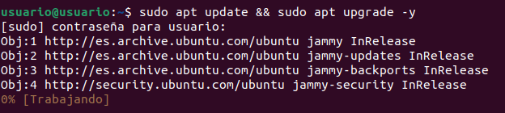

```
sudo apt install bind9 -y
```
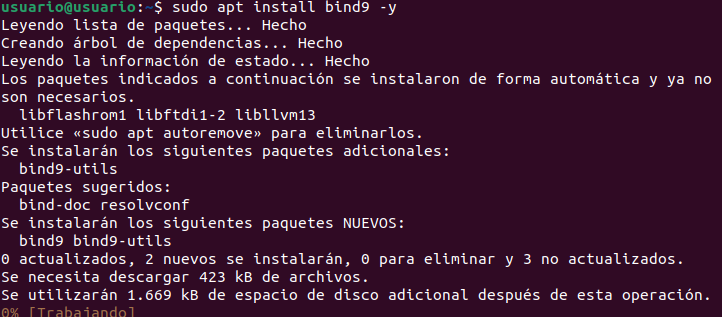

Vefiricamos que BIND se esta ejecutando:
```
systemctl status bind9
```
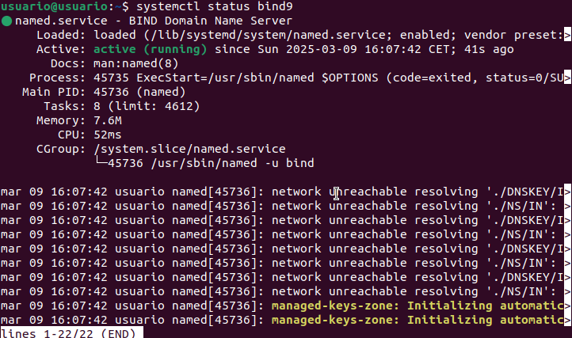

---
## Configurar BIND9 como Servidor Caché
---
Empezaremos editaremos el archivo de configuracion y lo editaremos de esta manera:
```
sudo nano /etc/bind/named.conf.options
```
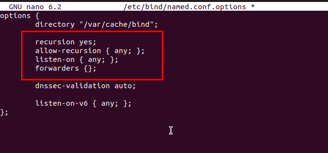

Comprobamos de que no haya habido ningun error de sintaxis y si no aparece nada esta bien
```
sudo named-checkconf
```
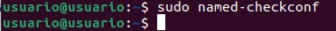

Con eso reiniciamos BIND y verificamos de vuelta
```
sudo systemctl restart bind9
systemctl status bind9
```
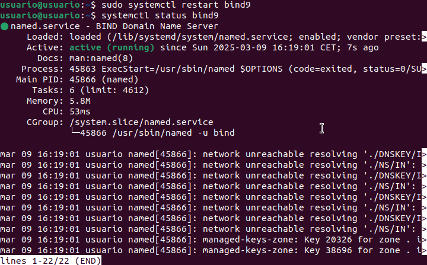

Ahora probaremos que puede resolver un dominio con google:
```
nslookup google.com 127.0.0.1
```
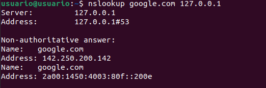

Y con eso revisamos el log:
```
sudo tail -f /var/log/syslog
```
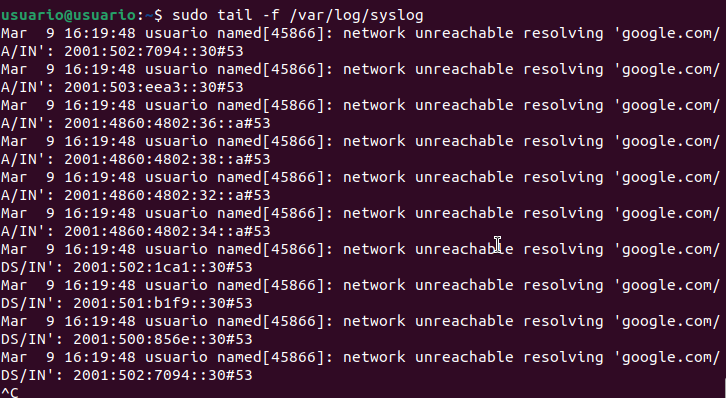

----
## Configurar BIND9 como Servidor Forwarding
--- 
Volvemos a editar el archivo de configuracion y agregamos esto:
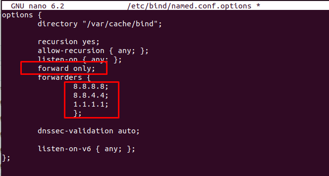

De nuevo comprobamos y reiniciamos:
```
sudo named-checkconf
sudo systemctl restart bind9
```
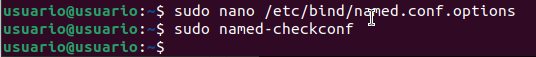
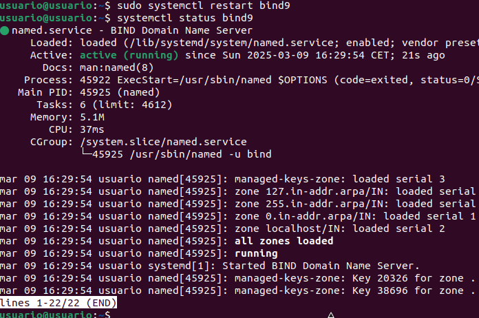

Y por ultimo hacemos una consulta:
```
nslookup facebook.com 127.0.0.1
```
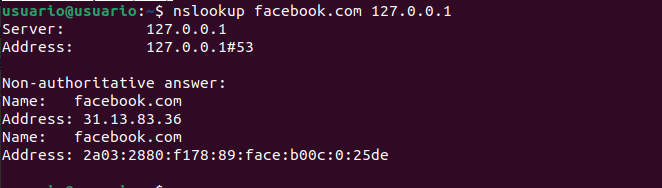
