### 1. Obtén la dirección IP de los siguientes dominios: www.uhu.es, www.us.es, es.wikipedia.org


```bash
dig +short www.uhu.es
dig +short www.us.es
dig +short es.wikipedia.org
```
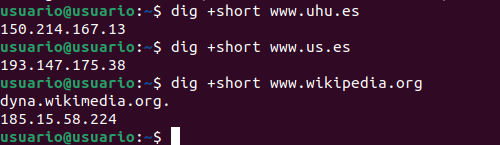

| www.uhu.es | 150.214.167.13 |
| www.us.es | 193.147.175.38 |
| es.wikipedia.org | 185.15.58.224 |

### 2. Obtén la dirección y los servidores DNS que corresponden a los siguientes dominios:  net, com, us.es, wikipedia.org.

Para obtener los servidores DNS de dominios:

```bash
dig +short net NS
dig +short com NS
dig +short us.es NS
dig +short wikipedia.org NS
```
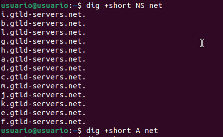
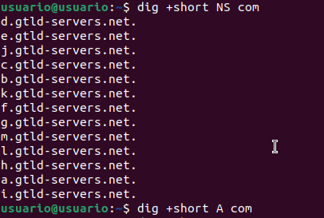
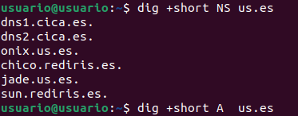
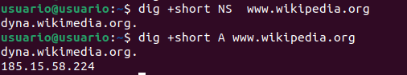

### 3. Averigua los registros MX de los siguientes dominios:  uhu.es, us.es, wikipedia.org

```bash
dig +short uhu.es MX
dig +short us.es MX
dig +short wikipedia.org MX
```
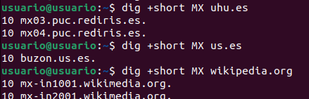

### 4. Obten la dirección IPV6 de www.isc.org

```bash
dig +short www.isc.org AAAA
```
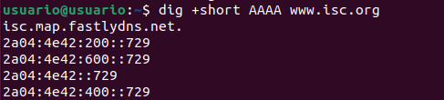

### 5. Muestra los servidores de correo de yahoo.com

```bash
dig +short yahoo.com MX
```
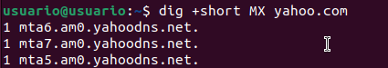

### 6. Muestra la información asociada con la dirección 75.126.153.206

```bash
dig -x 75.126.153.206
```
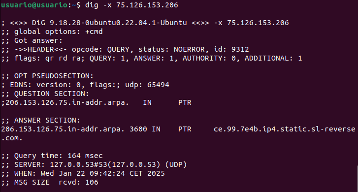

### 7. Muestra la dirección de www.google.es utilizando uno de los servidores DNS de google.com

```bash
dig www.google.es NS
```
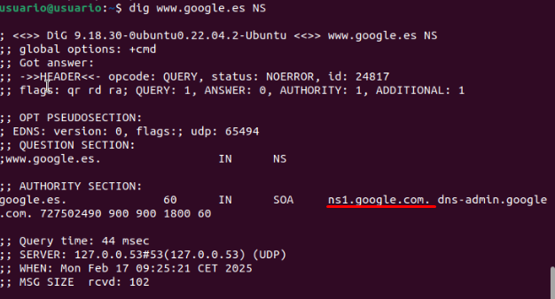

```bash
dig @ns1.google.com www.google.es
```
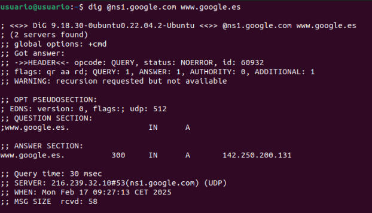

### 8. Muestra información sobre el TTL de drive.google.com. Ejecútalo en varias ocasiones y comprueba cómo cambia el valor

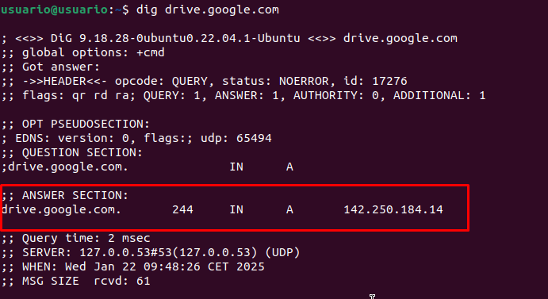

### 9. Muestra los registro type NS de redhat.com

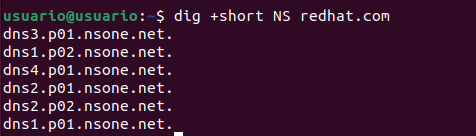

### 10. Muestra todos los registros de redhat

```bash
dig redhat.com ANY +noall +answer
```
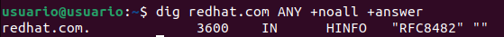

Como podemos obtener todos los resultados juntos, preguntamos uno a uno a cada uno de los registros.

```bash
dig redhat.com A +noall +answer
dig redhat.com MX +noall +answer
dig redhat.com NS +noall +answer
etc
```

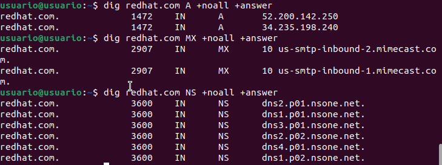

### 11. Crea un fichero de texto que contenga los dominios

```bash
nano domains.txt

redhat.com
google.com
amazon.com
wikipedia.org
```
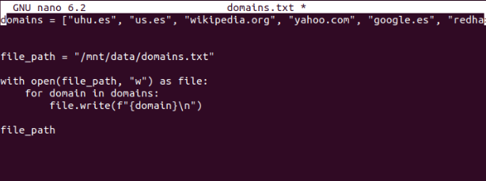

### 12. Haz una consulta con dig empleando el fichero anterior

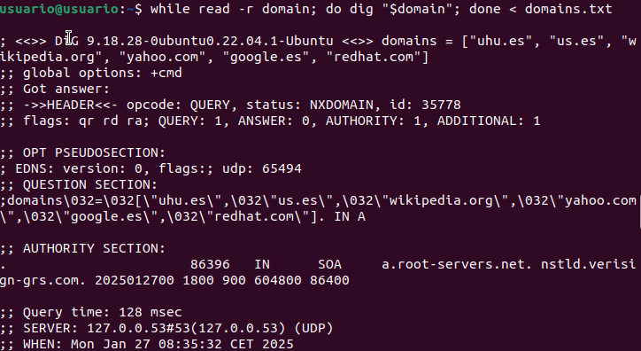
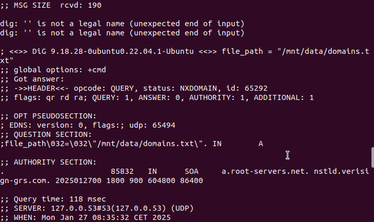
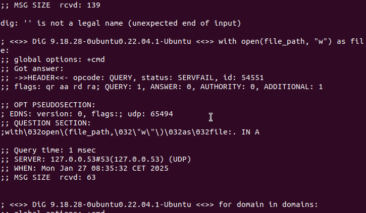
