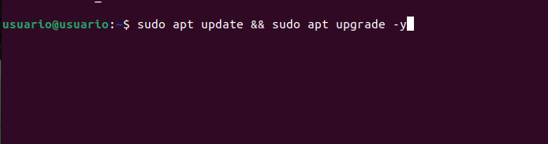
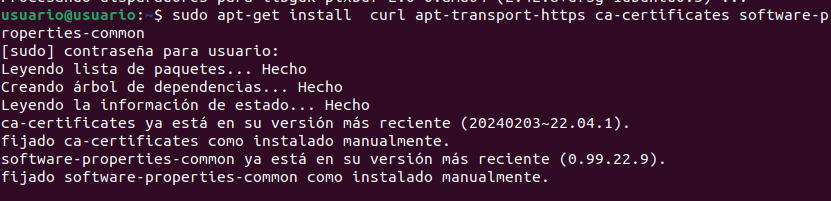
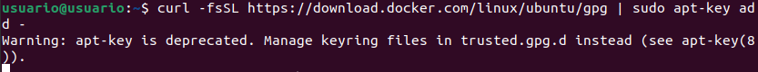
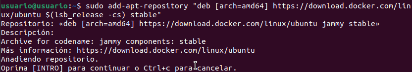
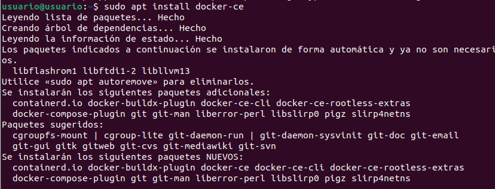
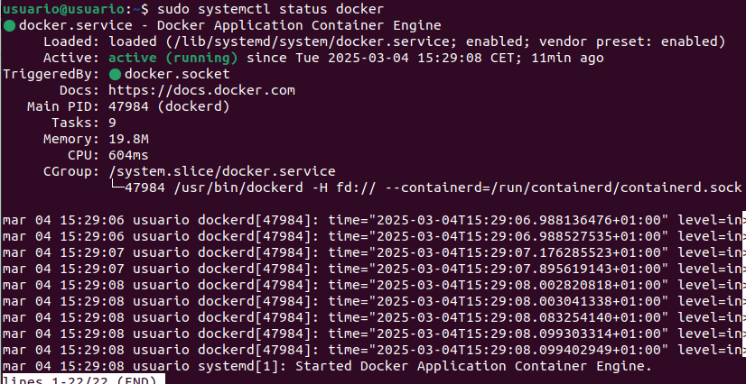

# Instalación de Docker en Ubuntu

Antes de instalar Docker, es recomendable actualizar la lista de paquetes:

```bash
sudo apt update && sudo apt upgrade -y
```


Docker requiere algunos paquetes adicionales y la clave GPG oficial de docker. Instálalos con:

```bash
sudo apt install -y apt-transport-https ca-certificates curl software-properties-common
```
```bash
curl -fsSL https://download.docker.com/linux/ubuntu/gpg | sudo gpg --dearmor -o /usr/share/keyrings/docker-archive-keyring.gpg
```



Agregamos el repositorio de Docker

```bash
sudo add-apt-repository "deb [arch=amd64] https://download.docker.com/lin ux/ubuntu $(lsb_release -cs) stable"
```


Actualizar los paquetes una vez mas e instalamos Docker

```bash
sudo apt update
sudo apt install -y docker-ce docker-ce-cli containerd.io
```



Para asegurarte de que Docker se ejecute al iniciar el sistema, usa:

```bash
sudo systemctl enable docker
```

Verificamos el estado del servicio Docker

```bash
sudo systemctl status docker
```



Si Docker está corriendo correctamente, verás un mensaje indicando que está "active (running)".
