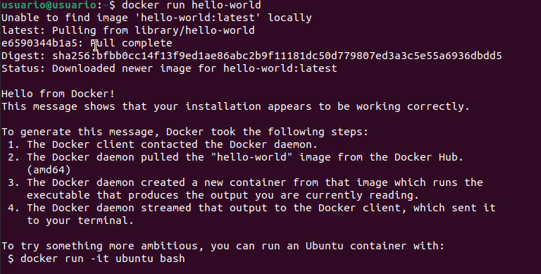
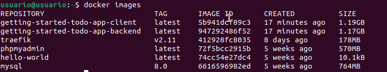
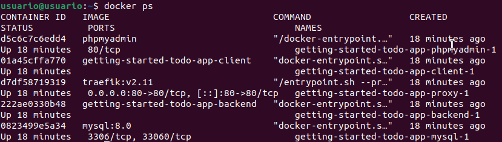
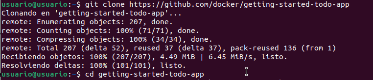
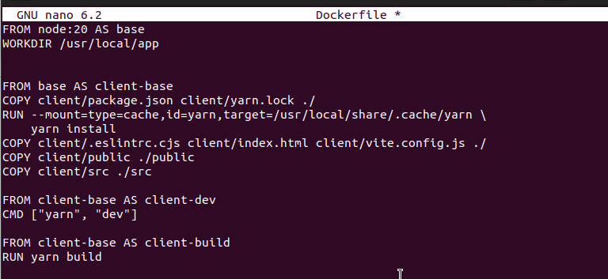
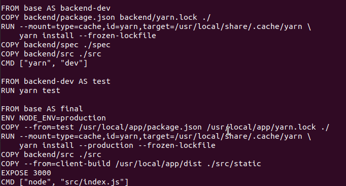
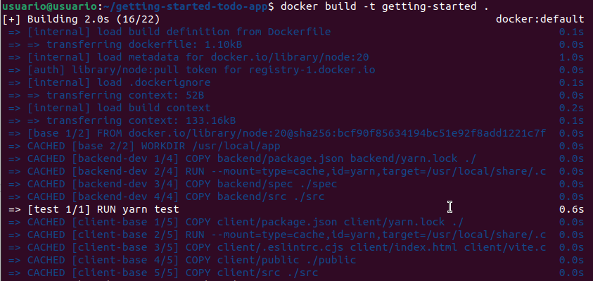
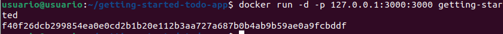
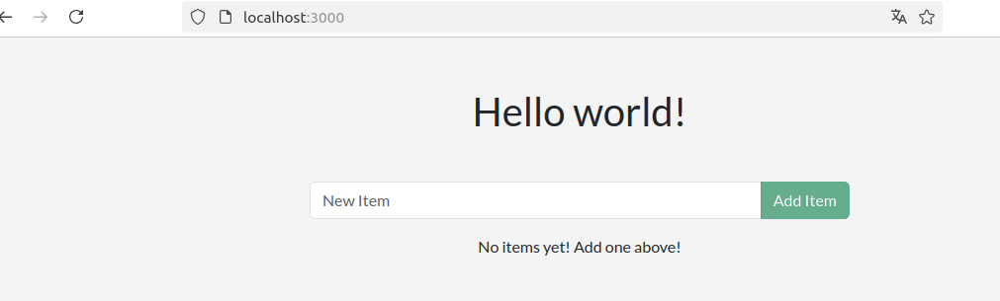

# PRIMERA PRACTICA

## Ejecutar la imagen "hello-world"
Para ejecutar la imagen de prueba de Docker, usa el siguiente comando:

```bash
docker run hello-world
```


## Mostrar las imágenes Docker instaladas
Para ver todas las imágenes descargadas en el sistema, usa:

```bash
docker images
```


## Mostrar los contenedores Docker
Para ver los contenedores en ejecución, usa:

```bash
docker ps
```


# SEGUNDA PRACTICA

## Editar el fichero Dockerfile
Primero descargaremos la carpeta `getting-started-todo-app` que contendra nuestro `Dockerfile` y veremos lo que contiene:
```bash
 git clone https://github.com/docker/getting-started-todo-app
```
```bash
sudo nano Dockerfile
```




## Construir el contenedor
Ejecuta el siguiente comando para construir la imagen:

```bash
docker build -t getting-started .
```


## Ejecutar el contenedor
Para ejecutar el contenedor basado en la imagen creada:

```bash
docker run -d -p 127.0.0.1:3000:3000 --name getting-started
```



## Publicar la imagen en Docker Hub

1. Inicia sesión en Docker desde la terminal:
   
   ```bash
   docker login
   ```
   
2. Etiqueta la imagen con tu usuario de Docker Hub:
   
   ```bash
   docker tag getting-started TU_USUARIO/getting-started
   ```

3. Sube la imagen a Docker Hub:
   
   ```bash
   docker push TU_USUARIO/getting-started
   ```


