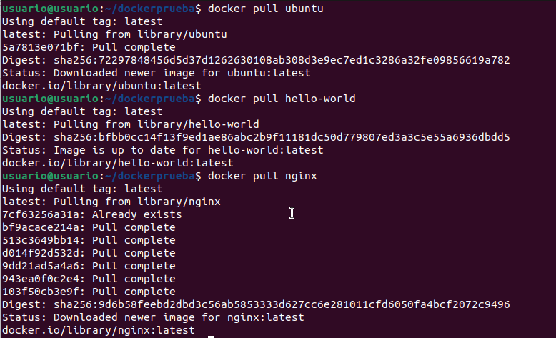
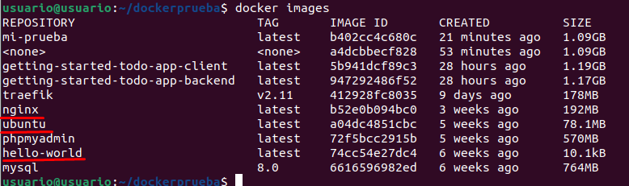
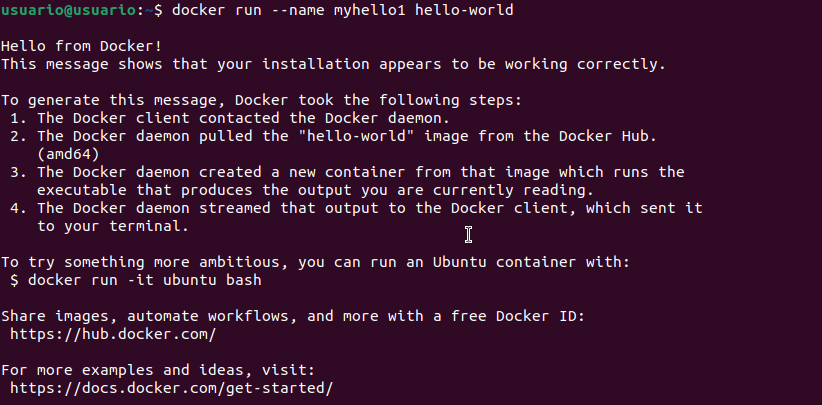
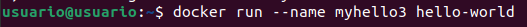
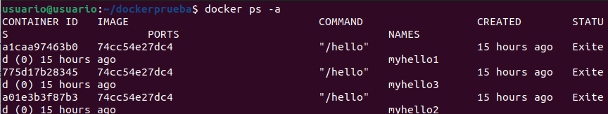
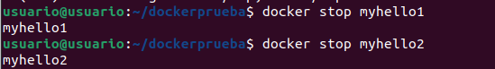
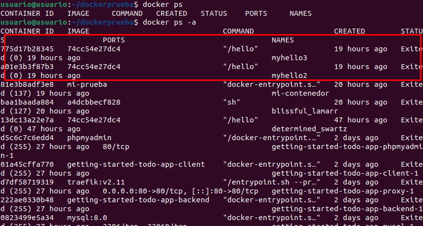
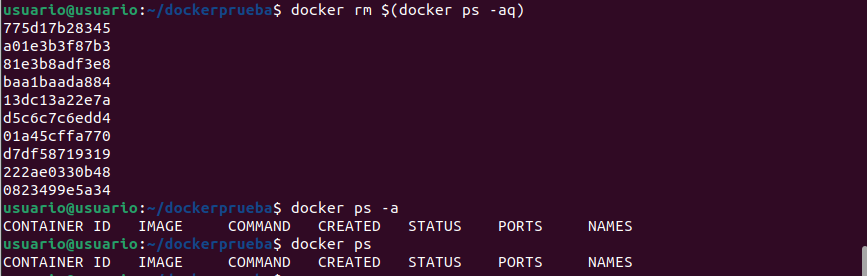

# Docker 3

## Descargar imágenes
Para descargar las imágenes de Ubuntu, hello-world y nginx, ejecuta:

```bash
docker pull ubuntu
docker pull hello-world
docker pull nginx
```


## Mostrar un listado de todas las imágenes
Para listar todas las imágenes descargadas en el sistema:

```bash
docker images
```


## Ejecutar contenedores hello-world con nombres específicos
Ejecuta tres contenedores de `hello-world`, asignándoles nombres personalizados:

```bash
docker run --name myhello1 hello-world

docker run --name myhello2 hello-world

docker run --name myhello3 hello-world
```



## Mostrar los contenedores en ejecución
Para ver los contenedores inactivos ya hello-world es un image que se para cuando ejecuta su funcion para:

```bash
docker ps -a
```


## Detener contenedores
Para detener los contenedores `myhello1` y `myhello2`:

```bash
docker stop myhello1

docker stop myhello2
```


## Borrar el contenedor “myhello1”

```bash
docker rm myhello1
```

## Mostrar nuevamente los contenedores en ejecución

```bash
docker ps -a
```


## Borrar todos los contenedores
Para eliminar todos los contenedores, incluidos los detenidos:

```bash
docker rm $(docker ps -aq)
```

