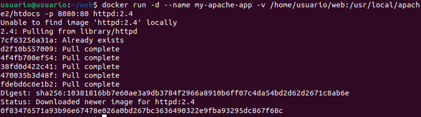
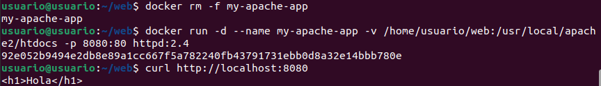
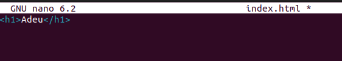
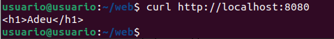
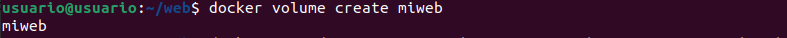
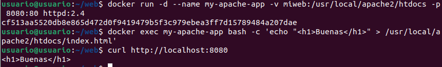
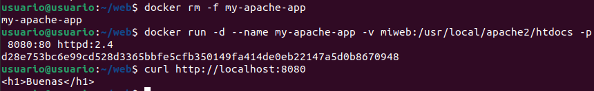
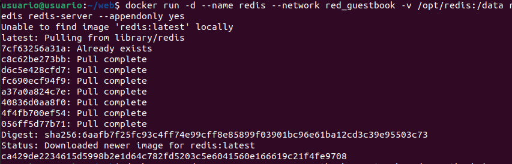
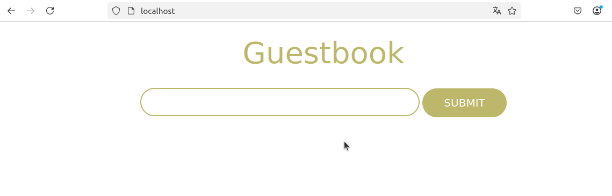

# PRIMERA PRÁCTICA

## Uso de Bind Mounts para Asociar Almacenamiento

### Ejemplo: Montaje de Directorios con Bind Mount

Vamos a crear un directorio en el sistema del host y un archivo `index.html` dentro de él:

```bash
mkdir web
cd web
```


Luego, iniciamos un contenedor y montamos este directorio usando la opción `-v`:

```bash
docker run -d --name my-apache-app -v /home/usuario/web:/usr/local/apache2/htdocs -p 8080:80 httpd:2.4
```


Comprobamos que el contenido se está sirviendo correctamente:

```bash
curl http://localhost:8080
```


Si eliminamos y volvemos a crear el contenedor, el contenido del archivo seguirá disponible:

```bash
docker rm -f my-apache-app
docker run -d --name my-apache-app -v /home/usuario/web:/usr/local/apache2/htdocs -p 8080:80 httpd:2.4
curl http://localhost:8080
<h1>Hola</h1>
```


Podemos modificar el archivo sin necesidad de reiniciar el contenedor:

```bash
echo "<h1>Adeu</h1>" > web/index.html 
curl http://localhost:8080
```



Si la carpeta de origen no existe, se creará, pero el contenedor tendrá un directorio vacío.

---

# SEGUNDA PRÁCTICA
## Usando volúmenes Docker para persistencia de datos

A diferencia de los bind mounts, los volúmenes de Docker se gestionan directamente a través del motor de Docker y son recomendados para almacenar datos persistentes.

### Ejemplo: Creación y uso de volúmenes en Docker

Creamos un volumen llamado `miweb`:

```bash
docker volume create miweb
```



Iniciamos un contenedor y asociamos el volumen con `-v`:

```bash
docker run -d --name my-apache-app -v miweb:/usr/local/apache2/htdocs -p 8080:80 httpd:2.4
```



Creamos un archivo dentro del contenedor y verificamos su contenido:

```bash
docker exec my-apache-app bash -c 'echo "<h1>Hola</h1>" > /usr/local/apache2/htdocs/index.html'
curl http://localhost:8080
<h1>Hola</h1>
```

Eliminamos el contenedor y lo recreamos usando el mismo volumen:

```bash
docker rm -f my-apache-app
docker run -d --name my-apache-app -v miweb:/usr/local/apache2/htdocs -p 8080:80 httpd:2.4
```



Confirmamos que el archivo `index.html` sigue disponible:

```bash
curl http://localhost:8080
<h1>Hola</h1>
```
# TERCERA PRÁCTICA

## Despliegue de la Aplicación Guestbook con Redis

Vamos a desplegar una aplicación web (`guestbook`) que necesita una base de datos Redis.

### Creación de una Red Compartida

```bash
docker network create red_guestbook
```

### Ejecución de los Contenedores

```bash
docker run -d --name redis --network red_guestbook -v /opt/redis:/data redis redis-server --appendonly yes
docker run -d -p 80:5000 --name guestbook --network red_guestbook iesgn/guestbook
```


