# PRIMERA PRACTICA

## Almacenamiento con Docker Compose

### Definiendo volúmenes Docker con Docker Compose

Además de definir los `services`, en el fichero `docker-compose.yaml` podemos definir los volúmenes que vamos a necesitar en nuestra infraestructura. Además, podremos indicar qué volumen va a utilizar cada contenedor.

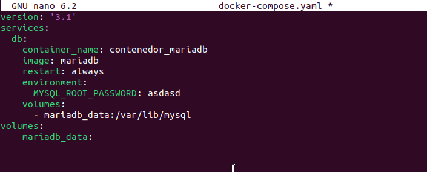

Iniciamos el escenario:

```bash
docker compose up -d
```
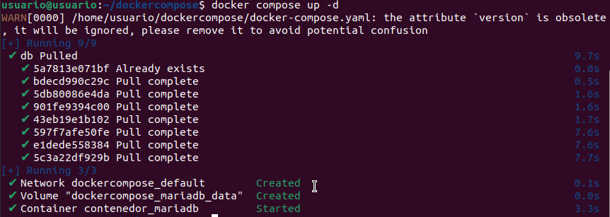

Si quereremos ver los contenedores activos:

```bash
docker compose ps
```
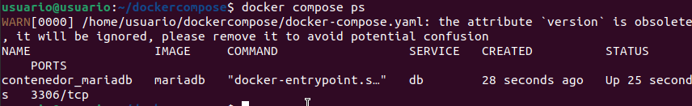

Y si queremos ver volúmenes creados:

```bash
docker volume ls
```
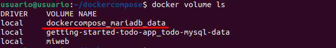

Podemos comprobar que efectivamente se ha realizado el montaje:
```bash
docker inspect -f '{{json .Mounts}}' contenedor_mariadb
```
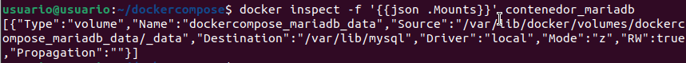


Si se necesita reiniciar desde cero necitaremso borrar el volumen:

```bash
docker compose down -v
```
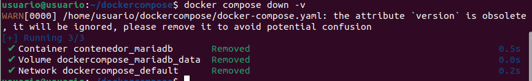


### Utilización de bind mount con Docker Compose

Ejemplo de bind mount en `docker-compose.yaml`:

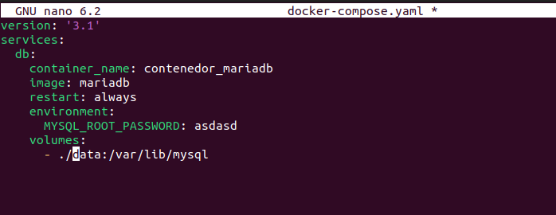


Después de iniciar el escenario, el directorio `data` se habrá creado y contendrá los datos de MySQL.
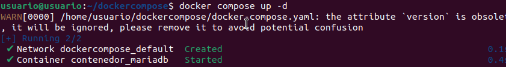
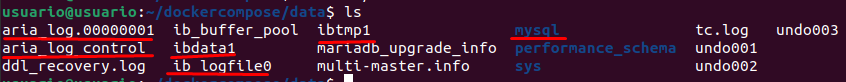


---

# SEGUNDA PRACTICA

## Despliegue de Let's Chat

Para desplegar Let's Chat, ejecutar:

```bash
docker compose up -d
```

Si las imágenes no están disponibles localmente, se descargarán automáticamente.

Ver contenedores en ejecución:

```bash
$ docker compose ps
```
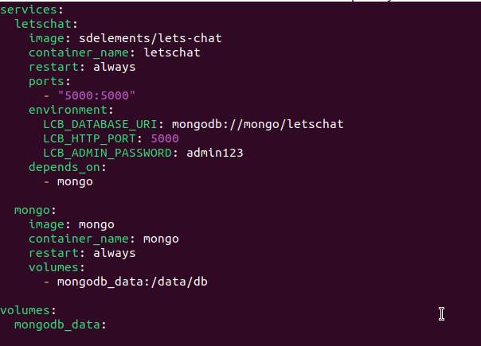
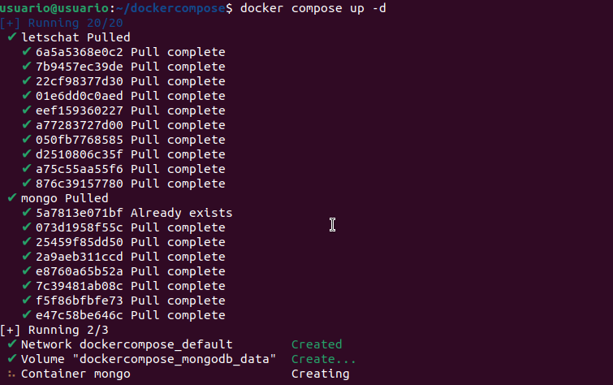


Accederemos desde el navegador a la aplicación.
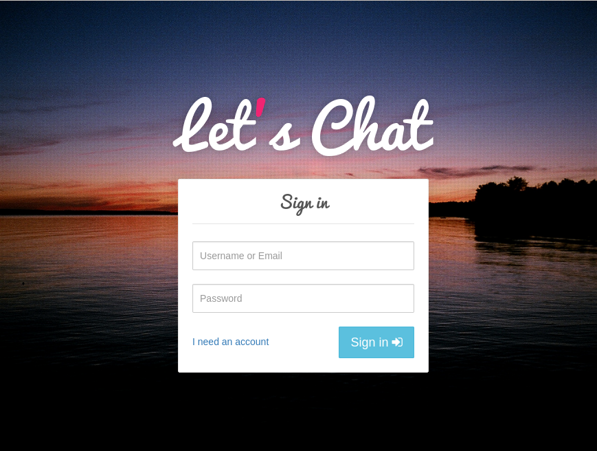


Para detener y eliminar los contenedores al igual que los volumenes:

```bash
$ docker compose down
```:

```bash
$ docker compose down -v
```
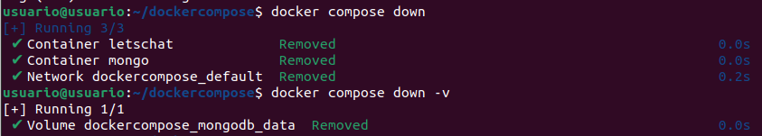


---


# TERCERA PRACTICA

## Configuración del `docker-compose.yaml`

Para ejecutar guessbook con Docker Compose, se debe definir el siguiente archivo `docker-compose.yaml` dentro de su propio directorio:

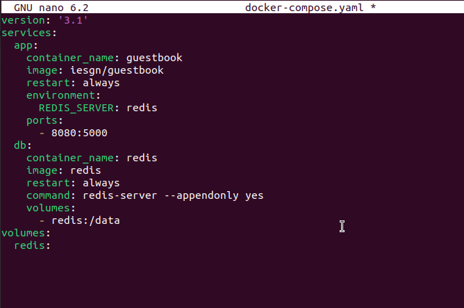


Ejecutar el despliegue:

```bash
$ docker compose up -d
```
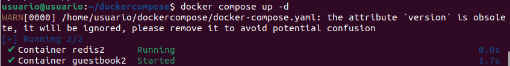

Y podremos ver desde el navegador que se habra mantenido algunos datos de otra practiga de guessbook:

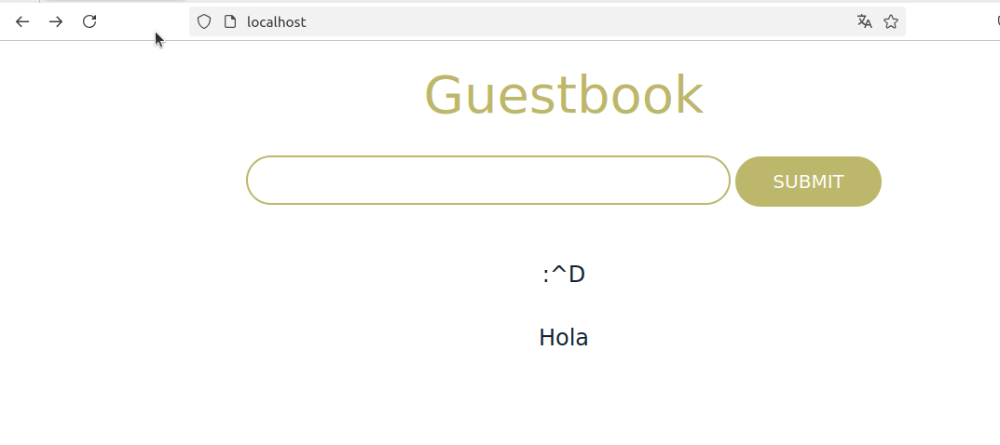


Para detener y eliminar la aplicación y i es necesario eliminar los volúmenes:

```bash
$ docker compose down
```
```bash
$ docker compose down -v
```
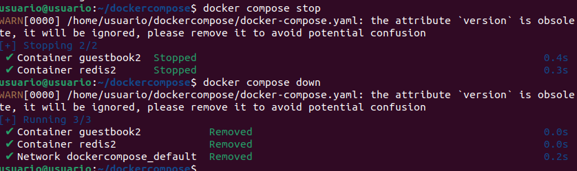

