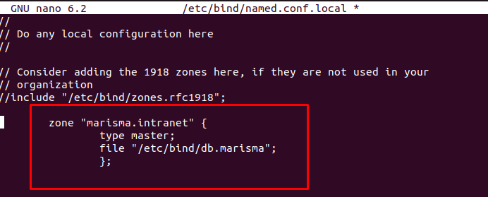
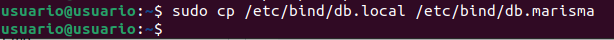
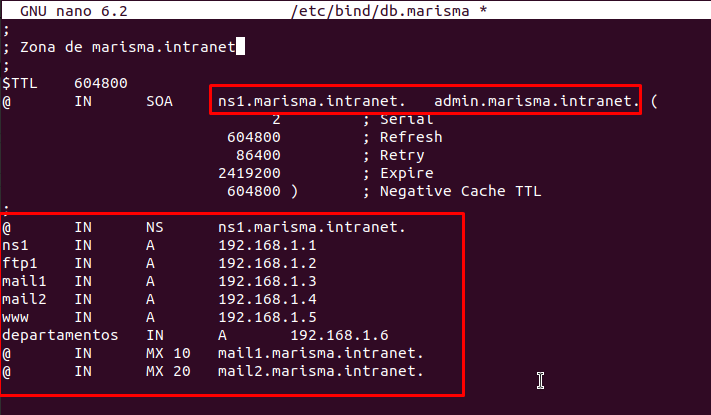
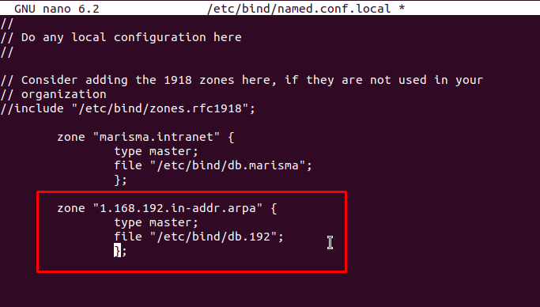
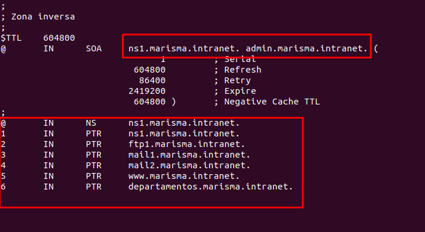
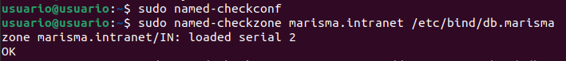
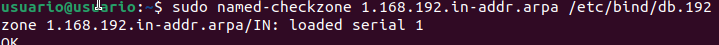
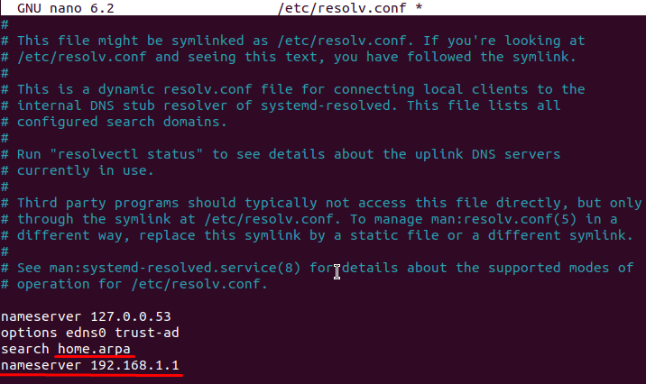
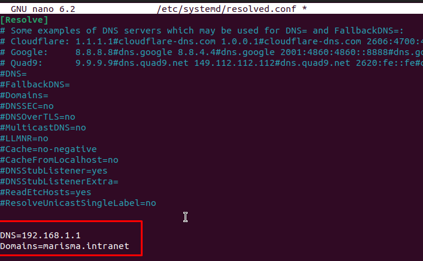
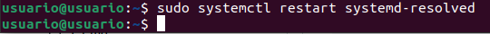

# Master DNS server
---
## Configurar Zona Directa
---
Comenzaremos editando el archivo de congiguracion de BIND para agragar la zona maestra.
```
sudo nano /etc/bind/named.conf.local
```
Y añadimos esto:



Creamos el archivo de la zona compiando el archivo `/etc/bind/db.local`
```
sudo cp /etc/bind/db.local /etc/bind/db.marisma
```



Y lo editamos de esta manera:
```
sudo nano /etc/bind/db.marisma
```

 
--- 
## Configurar Zona Inversa
---
Ahora editaremos de vuelta archivo de congiguracion de BIND para agragar la zona inversa.
```
sudo nano /etc/bind/named.conf.local
```


De igual manera, creamos el archivo de la zona inversa copiando el archico `/etc/bind/db.127`
```
sudo cp /etc/bind/db.127 /etc/bind/db.192
```
 

Y lo editamos de esta manera:

```
sudo nano /etc/bind/db.192
```



Cuando terminenos reiniciaremos BIND.
```
sudo systemctl restart bind9
```


Y probaremos si la sintaxis de todo es correcta
```
sudo named-checkconf
sudo named-checkzone marisma.intranet /etc/bind/db.marisma
sudo named-checkzone 1.168.192.in-addr.arpa /etc/bind/db.192
```




---
## Configurar Cliente DNS
--- 
Primero editaremoel archivo de resilucion de DNS
```
sudo nano /etc/resolv.conf
```

Habra que añadir una direccion en `search` y agregar el `servername` 


Para hacer que la configuracion persistente tendremos que el archivo `resolved.conf`
```
sudo nano /etc/systemd/resolved.conf
```

Agregaremos:



Y reiniciaremos el servicio
```
sudo systemctl restart systemd-resolved
```

## Pruebas de Resolución de Nombres

Por ultimo realizaremos las consultas para comprobar la configuracion:
```
dig @192.168.1.1 marisma.intranet
dig @192.168.1.1 -x 192.168.1.1
dig @192.168.1.1 NS marisma.intranet
dig @192.168.1.1 MX marisma.intranet
```

