# PROYECTO 1º TRIMESTRE

## Instalación del servidor web apache.
---
Para esto actulizaremos los paquetes y despues instalaremos apache con estos comandos
``` cmd
sudo apt-get update
```
``` cmd
sudo apt-get install apache2
```
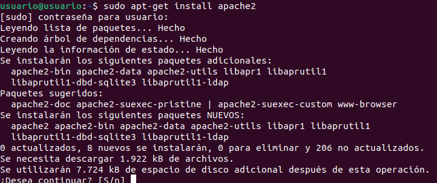

Para comprobar que se ha instalado correctamente iremos al navegador y escribiremos `localhost` o `127.0.0.1` en la barra de direcciones.

Deberia aparecer esto si la instalcion a salido bien:
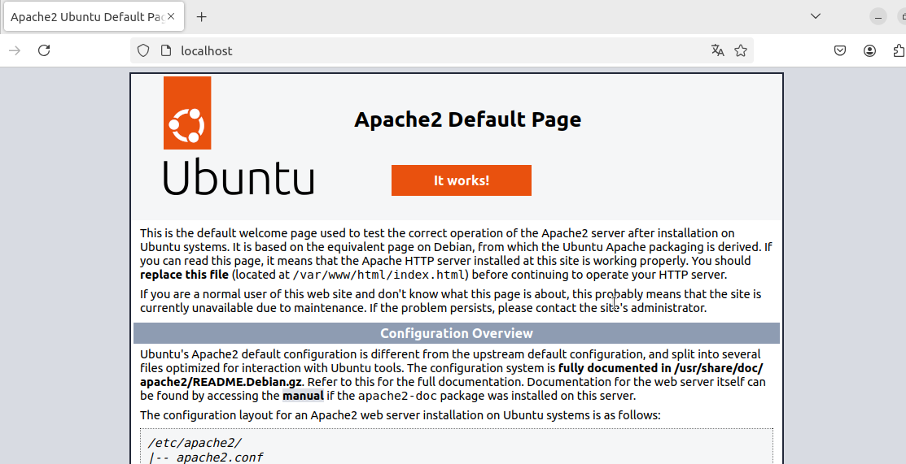

### Configuración del archivo hosts
---

Con la instalacion hecha, crearemos los dominios `centro.intranet` y `departamentos.centro.intranet`. Para eso editaremos el archivo `hosts`:
``` cmd
sudo nano /etc/hosts
```
Y añadimos en el codigo:
``` cmd
127.0.0.1 centro.intranet
127.0.0.1 departamentos.centro.intranet
```
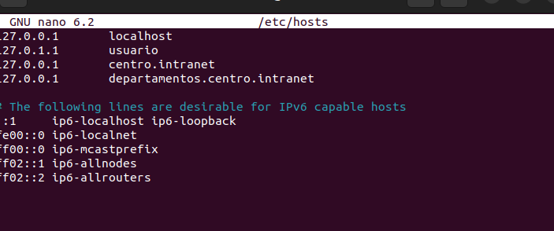

Comprobamos se ha modificado correctamente:

``` cmd
apachectl configtest
```
Si la sintasis es conrrecta, reiniciamos los servidores:
``` cmd
sudo service apache2 restart
```
Comprobamos que los dominios funcionan entrando a `centro.intranet` y `departamentos.centro.intranet` desde el navegador.

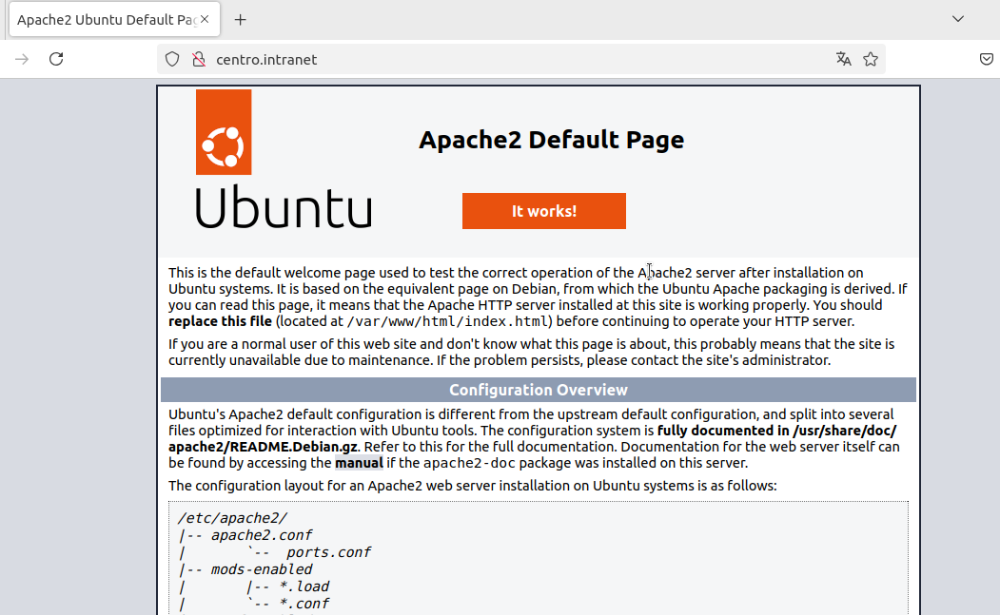

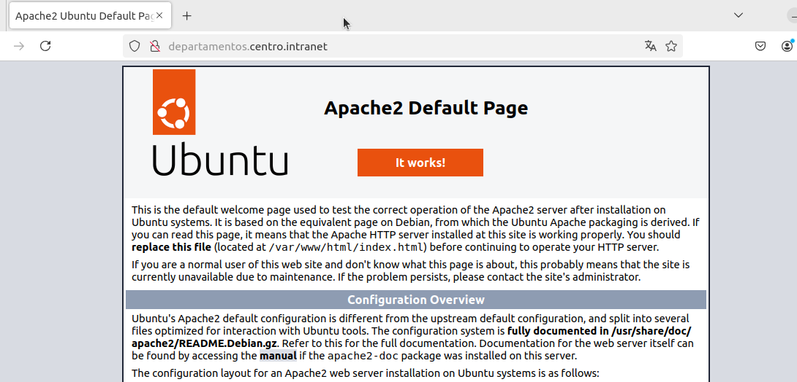

---

## Activar los módulos necesarios para ejecutar php y acceder a mysql
----

### SQL

Primero, instalaremos y activaremos los modulos SQL:

``` cmd
sudo apt install mysql-server
```
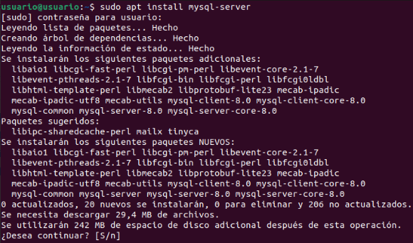

``` cmd
sudo mysql_secure_installation
```
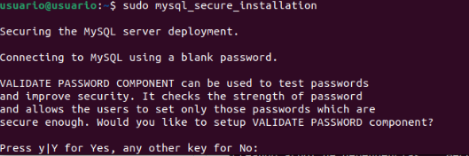

Podemos comprobar si se han instalado con:
``` cmd
sudo mysql
```
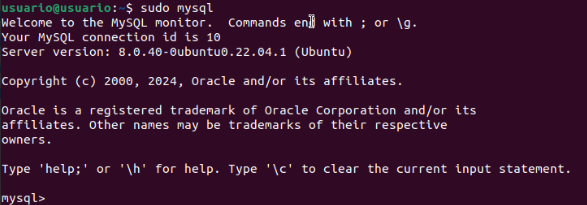

### PHP

Para instalar y activar los modulos PHP ejecutaremos:
``` cmd
sudo apt install php libapache2-mod-php php-mysql
```
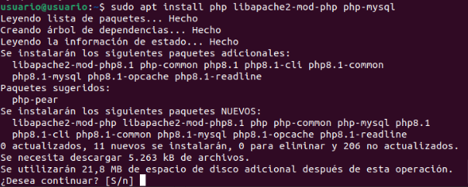

Y comprobamos si se instalo correctamente con:
``` cmd
php -v
```
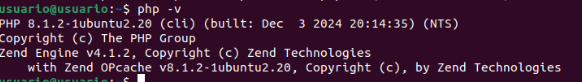

---
## Instalción y configuracion de Wordpress
---

### Creacion de directorios
---

Primero, crearemos los directorios para cada dominio antes de instala el Wordpress en nuestro servidor:
``` cmd
sudo mkdir /var/www/centro.intranet
sudo mkdir /var/www/departamentos.centro.intranet
```
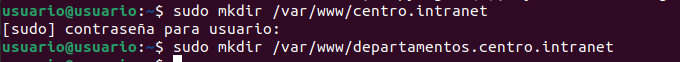

Le damos permisos:
``` cmd
sudo chown -R $USER:$USER /var/www/centro.intranet
sudo chown -R $USER:$USER /var/www/departamentos.centro.intranet
```
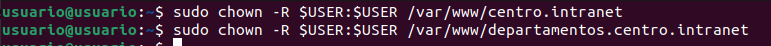

Tambien creamos el archivo de configuración de Apache para cada dominio:
``` cmd
sudo nano /etc/apache2/sites-available/centro.intranet.conf
sudo nano /etc/apache2/sites-available/departamentos.centro.intranet.conf
```
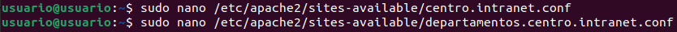
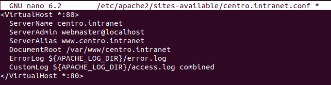
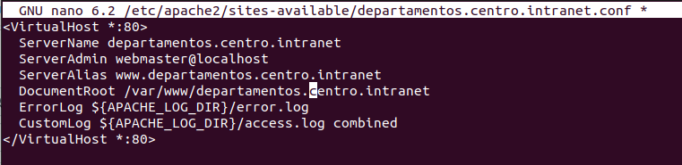

Y activamos los sitios webs:
``` cmd
sudo a2ensite centro.intranet
sudo a2ensite departamentos.centro.intranet
```
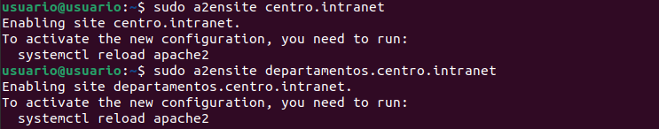

Comprobamos si estan bien configurados y reiniciamos apache:
``` cmd
apachectl configtest
```
``` cmd
sudo systemctl reload apache2
```
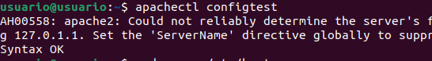
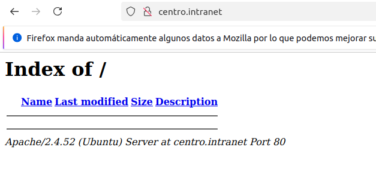
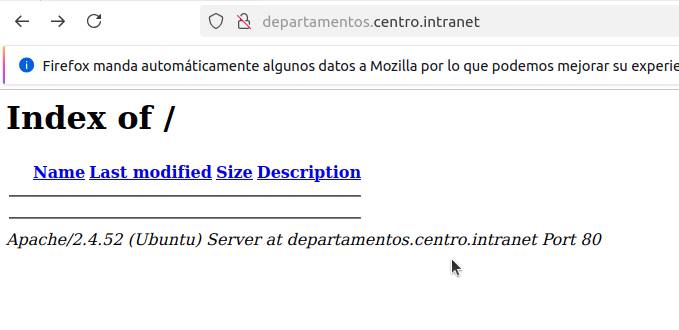

---
### MariaDB
---

Instalamos MariaDB:
``` cmd
sudo apt-get install mariadb-client mariadb-server
```
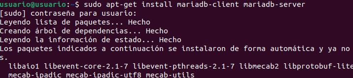
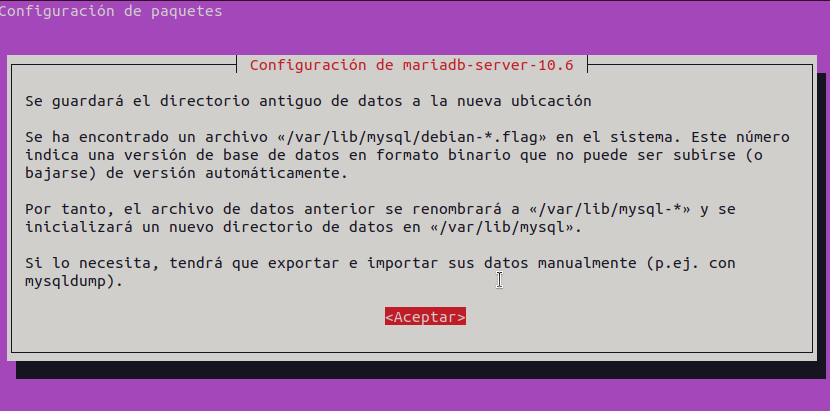

---
### WordPress 
---

Descargamos la ultima version de Wordpress:
``` cmd
sudo wget https://wordpress.org/latest.tar.gz
```
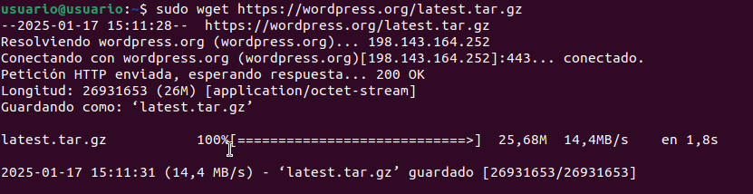

Y la descomprimimos:
``` cmd
sudo tar -xvf latest.tar.gz
```
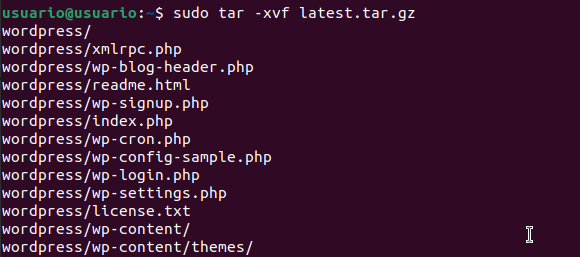

Podremos ver el contenido en la carpeta raiz, la moveremos en el directorio de `centro.intranet` y haremos una copia del fichero de configuración, el cual configuraremos despues:
``` cmd
ls
```
``` cmd
sudo mv wordpress/* /var/www/centro.intranet
```
``` cmd
sudo cp /var/www/centro.intranet/wp-config-sample.php /var/www/centro.intranet/wp-config.php
```
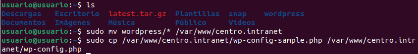

---
### Configuración de MariaDB
---

Entraremos en MariaDB y crearemos una base de datos para nuestro Worpress:
``` cmd
sudo mariadb
```
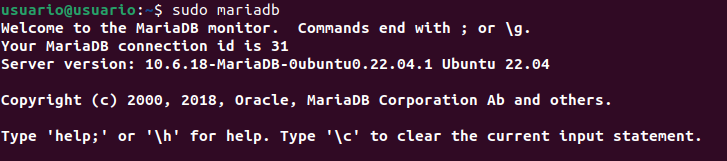

``` sql
CREATE DATABASE centro_intranet;
```

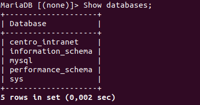

``` sql
CREATE USER 'usuario' IDENTIFIED BY 'usuario';
```
``` sql
GRANT ALL PRIVILEGES ON centro_intranet.* TO 'usuario' IDENTIFIED BY 'usuario';
```
---
### Configuración de WordPress
---

``` cmd
sudo nano /var/www/centro.intranet/wp-config.php
```
``` php
define( 'DB_NAME',      'centro_intranet' );
define( 'DB_USER',      'usuario' );
define( 'DB_PASSWORD',  'usuario');
```
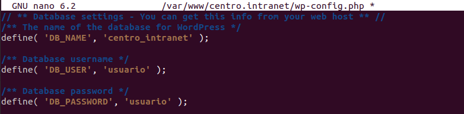

Accedemos a nuestra web de Worpress con `centro.intranet/wp-admin` y haremos la configuracion inicial.

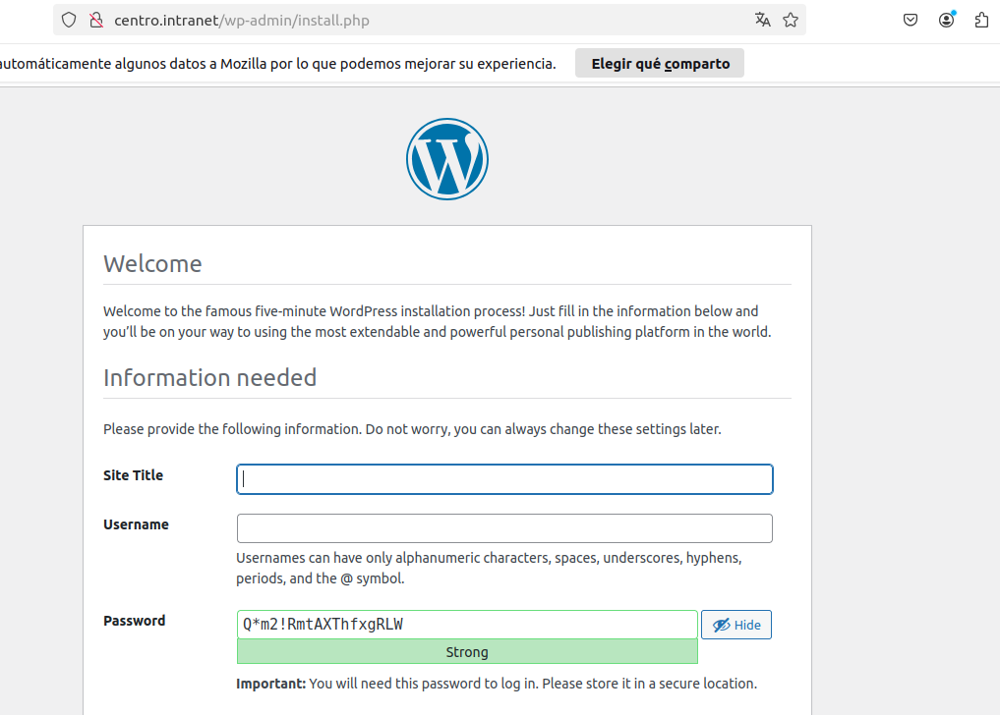
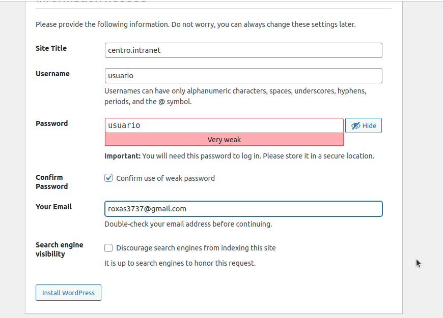
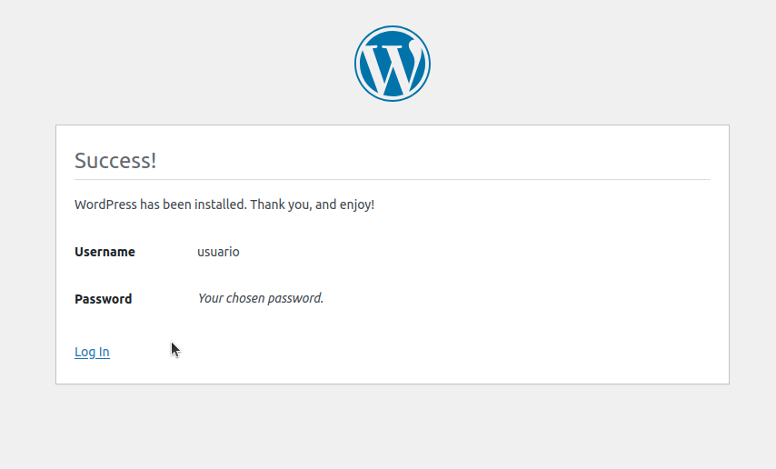
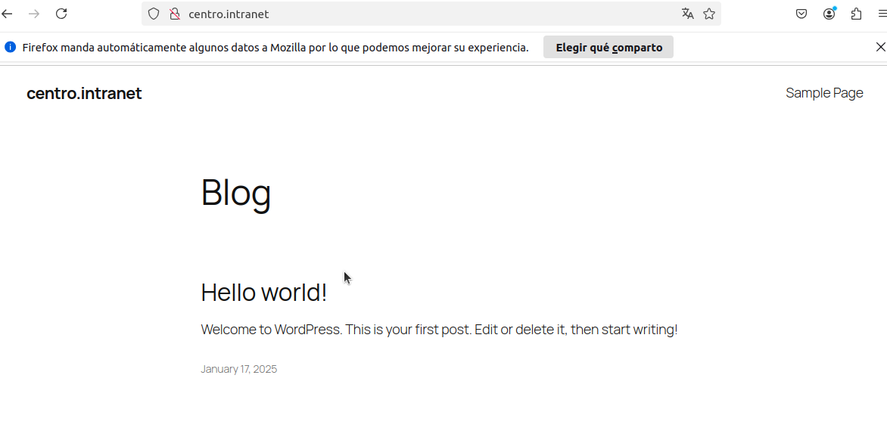

---
### Activar el módulo “wsgi” para permitir la ejecución de aplicaciones Python
---

Para activar el módulo `wsgi` utilizamos el comando:

``` cmd
sudo apt-get install libapache2-mod-wsgi-py3
```
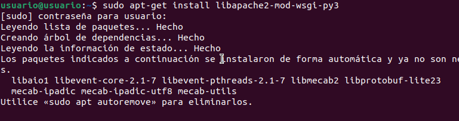

``` cmd
sudo a2enmod wsgi
```


---
## Crea y despliega una pequeña aplicación python para comprobar que funciona correctamente.
---

Primero creamos el directorio para la `logs`,`python` y `html`
``` cmd
cd /var/www/departamentos.centro.intranet
```
``` cmd
mkdir python
```
``` cmd
mkdir html
```
``` cmd
mkdir logs
```


Creamos la aplicación de Python con:
``` cmd
sudo nano python/prueba.py
```
``` python
#!/usr/bin/env python3

def application(environ, start_response):
    status = '200 OK'
    headers = [('Content-type', 'text/plain')]
    start_response(status, headers)
    return [b"Hola, esto es una prueba"]
```
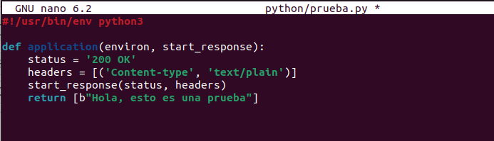

Y en la configuración de `departamentos.centro.intranet` agregamos el siguiente código para que ejecute la aplicacion de python.

``` apache
<VirtualHost *:80>
        ServerName      departamentos.centro.intranet
        ServerAdmin     webmaster@localhost
        ServerAlias     www.departamentos.centro.intranet
        DocumentRoot    /var/www/departamentos.centro.intranet
        WSGIScriptAlias / /var/www/departamentos.centro.intranet/python/prueba.py
        ErrorLog        /var/www/departamentos.centro.intranet/logs/error.log
        CustomLog       /var/www/departamentos.centro.intranet/logs/access.log combined

        <Directory />
                Options FollowSymLinks
                AllowOverride All
        </Directory>
</VirtualHost>
```
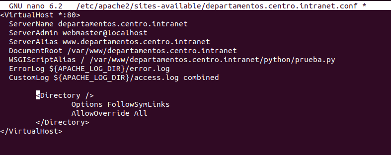

Damos permisos nuestro archivo y reiniciamos apache.
```cmd
sudo chown -R www-data:www-data /var/www/departamentos.centro.intranet
sudo chmod -R 755 /var/www/departamentos.centro.intranet
```
``` cmd
sudo systemctl restart apache2
```

Y ahora cuando entremos en `departamentos.centro.intranet` deberiamos leer el mensaje de nuestra aplicacion de Python.
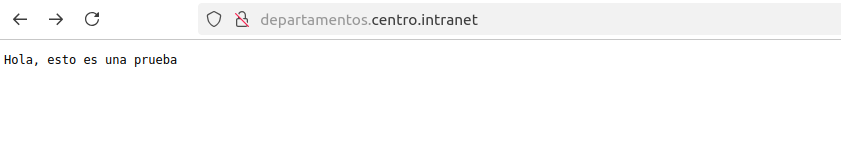

---
## Proteger el acceso a la aplicación python mediante autenticación
---
Si quieremos proteger el acceso al nuestra aplicacion, podemos utilizar una autentificacion con usuario y contraseña.

Para eso creamos un directorio llamado `password` dentro de `/var/www/departamentos.centro.intranet`:
``` cmd
sudo mkdir /var/www/departamentos.centro.intranet/password
```

Crearemos unas crecendiales
``` cmd
sudo htpasswd -c /var/www/departamentos.centro.intranet/password/passwords usuario
```
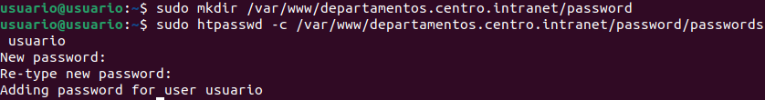

Dentro del archivo de configuracion del servidor agregamos este codigo:
``` cmd
sudo nano /etc/apache2/apache2.conf
```
``` apache
<Directory /var/www/departamentos.centro.intranet/python>
    AuthType Basic
    AuthName "Departamentos Centro Intranet"
    AuthUserFile /var/www/departamentos.centro.intranet/password/passwords
    Require user usuario
</Directory>
```
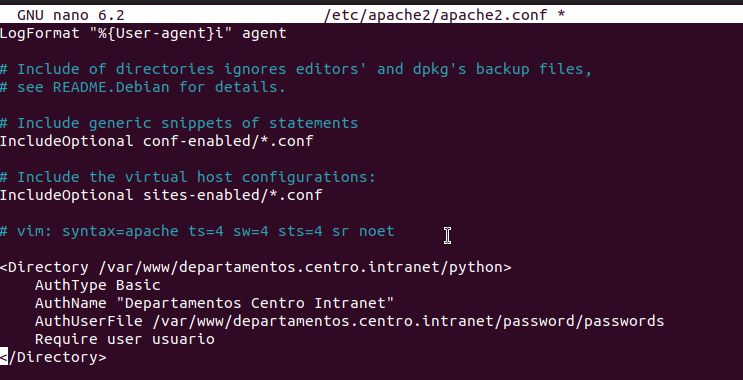

Reiniciamos apache y accedemos de nuevo a `departamentos.centro.intranet` y esta vez nos pedira un usuario y contraseña
```
sudo systemctl reload apache2
```
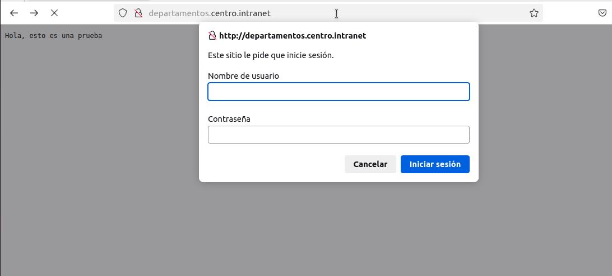

---
## Instalacion y configuracion AWStat
---
Primero instalaremos el servicio de AWStat
``` cmd
sudo apt-get install awstats
```
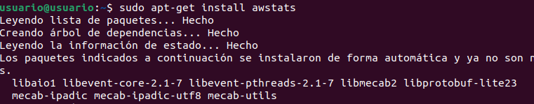

Activamos el modulo `a2enmod cgi`:
``` cmd
sudo a2enmod cgi
```
Y reiniciamos apache
``` cmd
systemctl restart apache2
```
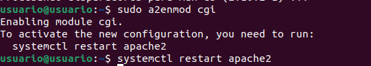

Ahora, modificaremos el archivo de configuracion de AWStat
``` cmd
sudo nano /etc/awstats/awstats.conf
```
Y modificamos las siguiente lineas:
``` apache
SiteDomain="centro.intranet"

HostAliases="centro.intranet"

AllowToUpdateStatsFromBrowser=1
```
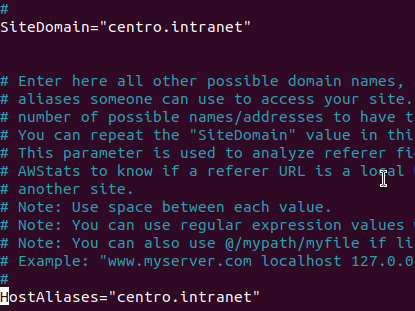
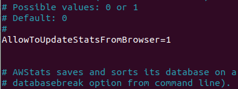

Ahora, generamos las estadísticas:
```
sudo /usr/lib/cgi-bin/awstats.pl -config=centro.intranet -update
```
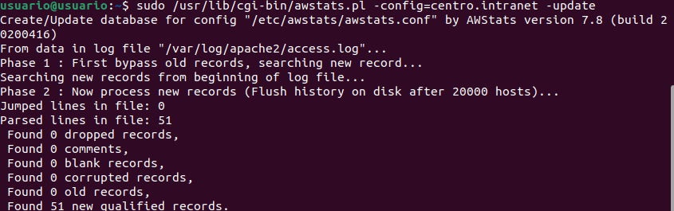

Configuramos el apache para poder acceder a las estadisticas
``` cmd
sudo cp -r /usr/lib/cgi-bin /var/www/centro.intranet
```
``` cmd
sudo chown -R www-data:www-data /var/www/centro.intranet/cgi-bin
```
``` cmd
sudo chmod -R 755 /var/www/centro.intranet/cgi-bin
```
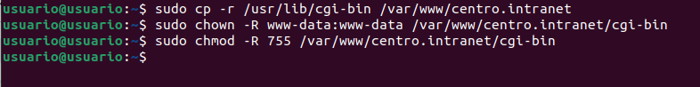

Y modifcamos la configuracion de AWStat en nuestro apache:
``` cmd
sudo nano /etc/apache2/conf-available/awstats.conf
```
``` apache
Alias /awstatsclasses "/usr/share/awstats/lib"
Alias /awstats-icon "/usr/share/awstats/icon/"
Alias /awstatscss "/usr/share/doc/awstats/examples/css"
ScriptAlias /awstats/ /usr/lib/cgi-bin/
Options +ExecCGI -MultiViews +SymLinksIfOwnerMatch
```
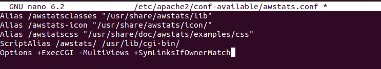

Habilitamos la configuración de AWStats y reiniciamos Apache.
``` cmd
sudo a2enconf awstats.conf
```
``` cmd
sudo systemctl reload apache2
```
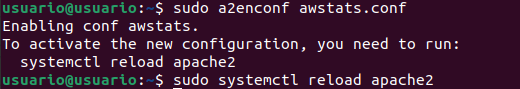

Con eso podremos acceder a las estadisticas con `centro.intranet/awstats/awstats.pl`

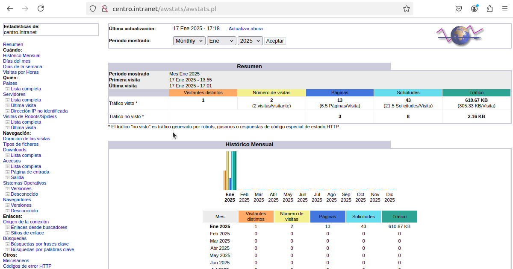

---
## Instalacion de segundo servidor de tu elección (nginx) bajo el dominio servidor2.centro.intranet
---
Primero tenemos que configurar para que el puerto 8080 sirva, al igual que en PHP.

Instalamos phpmyadmin usuando nginx como servidor web.
``` cmd
sudo apt-get install nginx
```
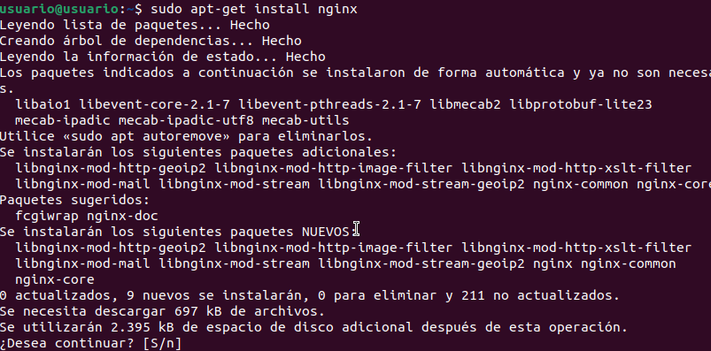

Despues, modificamos el archivo `nginx.conf` para que el servidor web se ejecute en el puerto 8080.

``` cmd
sudo nano /etc/nginx/nginx.conf
```
Y el apartado `http` y agregamos lo siguiente:
``` apache
http{
    server {
        listen 8080;
        listen [::]:8080;
    }
}
```
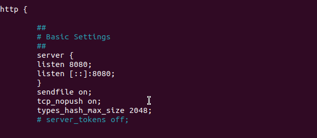

Modificamos el archivo de configuracion de `/etc/nginx/sites-available/default`
``` cmd
sudo nano /etc/nginx/sites-available/default
```
Modicamos estas lineas:
``` apache
server {
    listen 8080 default_server;
    listen [::]:8080 default_server;
}
```
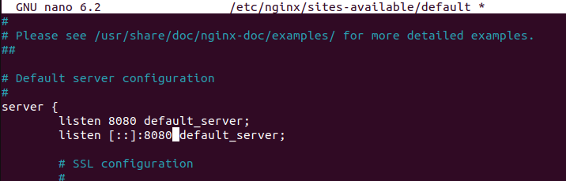

Ahora, comprobamos que la configuracion es conrrecta y reiniciamos nginx:
``` cmd
sudo nginx -t
```
``` cmd
sudo systemctl restart nginx
```
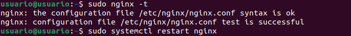

Luego, crearemos el directorio para nuestro archivo `/var/www/nginx` y crearemos un `index.html`
``` cmd
sudo mkdir /var/www/nginx
```
``` cmd
sudo nano /var/www/nginx/index.html
```


Añadimo un archivo html por defecto de nginx:
``` html
<!DOCTYPE html>
<html>
<head>
<title>Welcome to nginx!</title>
<style>
html { color-scheme: light dark; }
body { width: 35em; margin: 0 auto;
font-family: Tahoma, Verdana, Arial, sans-serif; }
</style>
</head>
<body>
<h1>Welcome to nginx!</h1>
<p>If you see this page, the nginx web server is successfully installed and
working. Further configuration is required.</p>

<p>For online documentation and support please refer to
<a href="http://nginx.org/">nginx.org</a>.<br/>
Commercial support is available at
<a href="http://nginx.com/">nginx.com</a>.</p>

<p><em>Thank you for using nginx.</em></p>
</body>
</html>
```
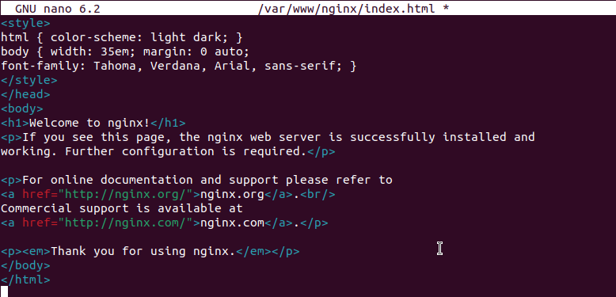

En el ultimo fichero de configuración, cambiaremos la línea `root /var/www/html;` a `root /var/www/nginx;` y añadimos el `server_name`.

``` apache
server {
    root /var/www/nginx;

    server_name servidor2.centro.intranet;
}
```
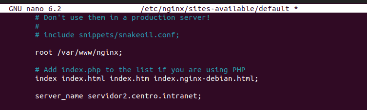

Con esta esta ultima modificación, iremos al fichero `hosts` y agremos el nombre.
``` cmd
sudo nano /etc/hosts
```
``` apache
127.0.0.1       servidor2.centro.intranet
```
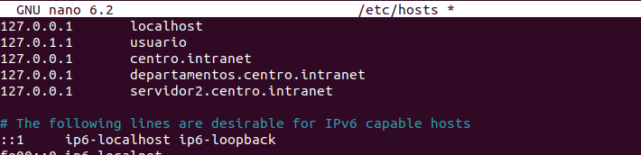

Y reiniciamos servidor
``` cmd
sudo systemctl restart nginx
```
Ahora, entraramos por el navegador con `servidor2.centro.intranet:8080`
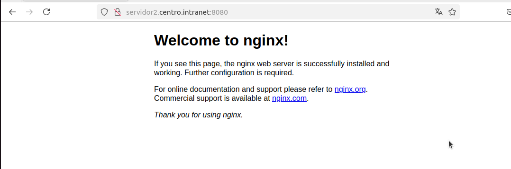

Despues de hacer nuestro servidor nginx, instalaremos phpmyadmin
``` cmd
sudo apt install phpmyadmin
```
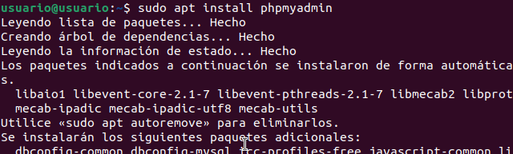

Creamos un enlace symbolicopara acceder desde nuestro navegador y modificaresmo los directorios para tener permisos con:
``` cmd
sudo ln -s /usr/share/phpmyadmin /var/www/nginx/phpmyadmin
```
``` cmd
sudo chown -R www-data:www-data /usr/share/phpmyadmin
```
``` cmd
sudo chmod -R 755 /usr/share/phpmyadmin
```
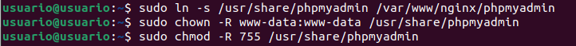

Volveremos en la configuracion del sitio web y agregamos estas lineas:
``` apache
location / {
  try_files $uri $uri/ =404;
}

location /phpmyadmin {
  root /var/www/nginx;
  index index.php index.html;

  location ~ ^/phpmyadmin/(doc|sql|setup)/ {
    deny all;
  }

  location ~ \.php$ {
    include snippets/fastcgi-php.conf;
    fastcgi_pass unix:/run/php/php8.1-fpm.sock;
    include fastcgi_params;
    fastcgi_param SCRIPT_FILENAME $document_root$fastcgi_script_name;
  }
}
```
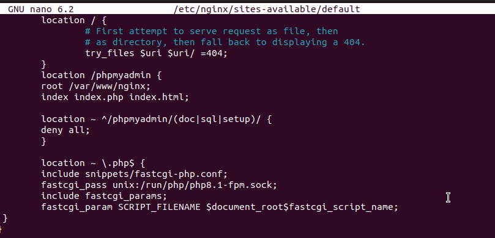

Ahora instalamos php-fpm:
``` cmd
sudo apt-get install php8.1-fpm
```
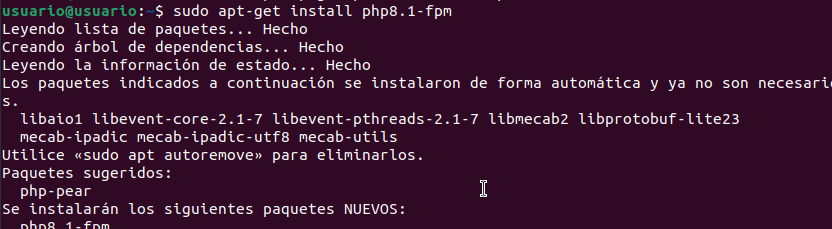

Y reiniciamos el servir nuevamente
```
sudo service nginx restart
```
Por ultimo, accedemos a `servidor2.centro.intranet:8080/phpmyadmin`, accedemos a la base de datos y iniciamos sesion con nuestro usuario.
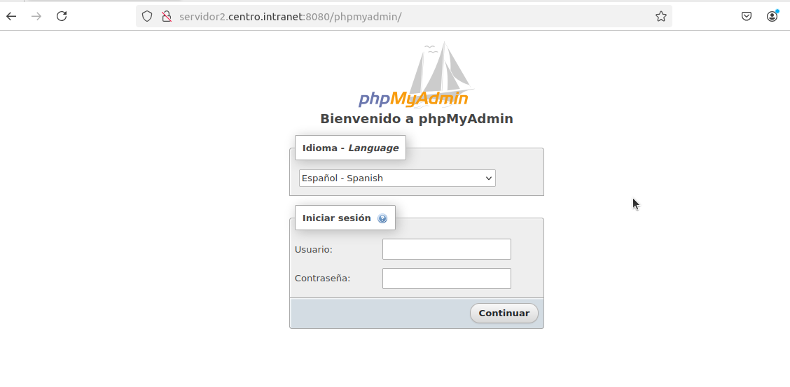
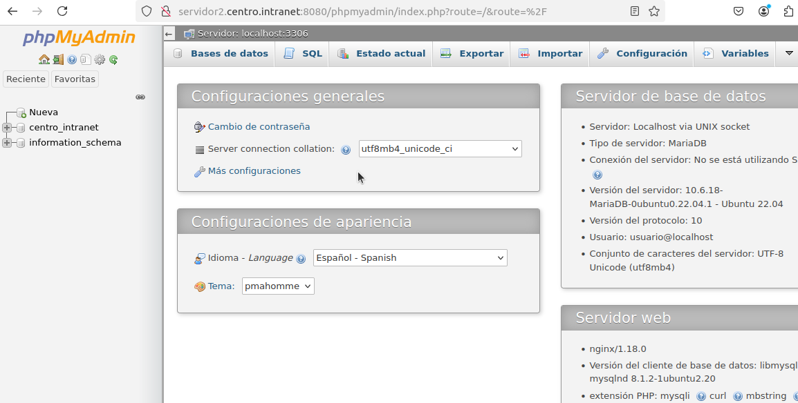
